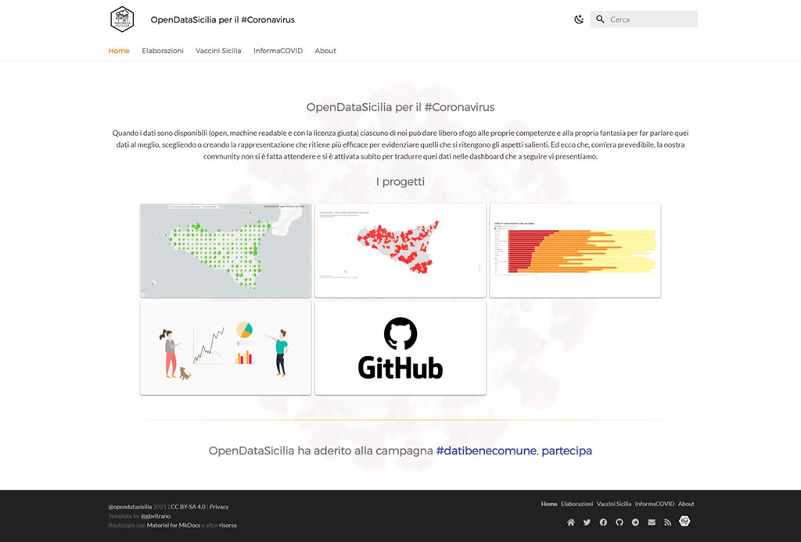

# OpenDataSicilia-per-il-Coronavirus

# Principali risorse usate per realizzare il sito

## Software
- [Visual Studio Code](https://code.visualstudio.com/)
- [Notepad ++](https://notepad-plus-plus.org/downloads/)
- [Screenpresso](https://www.screenpresso.com/f/)
- [GIMP (GNU Image Manipulation Program)](https://www.gimp.org/)
- [Inkscape](https://inkscape.org/it/)

## Static site generator
- [MkDocs](https://www.mkdocs.org/)
- [Material fopr MkDocs](https://squidfunk.github.io/mkdocs-material/)

## Plugin
- [mkdocs-macros](https://mkdocs-macros-plugin.readthedocs.io/en/latest/)
- [PyMdown Extensions](https://facelessuser.github.io/pymdown-extensions/)
- [MkDocs RSS plugin](https://guts.github.io/mkdocs-rss-plugin/)
- [GDPR compliance with the jQuery EU Cookie Law plugin](https://www.wimagguc.com/2018/05/gdpr-compliance-with-the-jquery-eu-cookie-law-plugin/)
- [PrognRoll](https://mburakerman.github.io/prognroll/)
- [SimpleLightbox](https://simplelightbox.com/)

### Compilazione con [GitHub ghpages](https://squidfunk.github.io/mkdocs-material/publishing-your-site/#with-github-actions) | [OpenDataSicilia per il Coronavirus](https://opendatasicilia.github.io/OpenDataSicilia-per-il-Coronavirus/)
