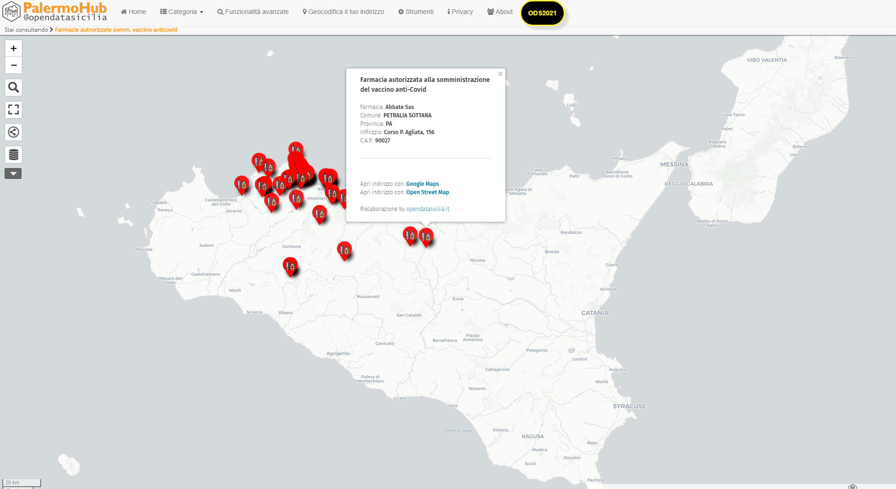
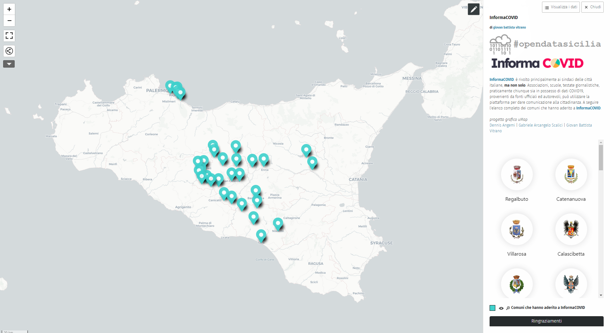

<body>
 <link href="stylesheets/home_page.css" rel="stylesheet">
   <section class="page-section">
    
 
          

        

          <h1>  OpenDataSicilia per il #Coronavirus</h1>
		  
 Quando i dati sono disponibili (open, machine readable e con la licenza giusta) ciascuno di noi può dare libero sfogo alle proprie competenze e alla propria fantasia per far parlare quei dati al meglio, scegliendo o creando la rappresentazione che ritiene più efficace per evidenziare quelli che si ritengono gli aspetti salienti. Ed ecco che, com’era prevedibile, la nostra community non si è fatta attendere e si è attivata subito per tradurre quei dati nelle dashboard che a seguire vi presentiamo.

		<!--  <h1> OpenDataSicilia ha aderito alla campagna <a href="https://www.datibenecomune.it/home/" title="#datibenecomune" target="_blank">#datibenecomune</a> </h1> -->
		   
 
		   

		   

   <!-- Elaborazioni -->
  <section class="page-section" id="portfolio">
    
 
          

        

          <h1>I progetti</h1>
          

        <!-- Elaborazioni OpendDataSicilia -->
		

          <a class="portfolio-box" href="vaccini/sit_vaccini/" title="Elaborazioni OpendDataSicilia | Dashboard Vaccini Sicilia| Giugno 2021" target="_self">
            
            

              

                Elaborazioni OpendDataSicilia
              

              

                Dashboard vaccini Sicilia | Giugno 2021
              

            

          </a>
        

	<!--Elaborazioni OpendDataSicilia zone rosse  -->
        

          <a class="portfolio-box" href="elaborazioni/ods/" title="Elaborazioni OpendDataSicilia | Comuni siciliani attualmente in zona rossa | 2021"  target="_self">
            
            

              

                Elaborazioni OpendDataSicilia
              

              

                Comuni siciliani attualmente in zona rossa | 2021
              

            

          </a>
        
		
	<!-- onData -->
        

          <a class="portfolio-box" href="elaborazioni/ondata/" title="Elaborazioni associazione onData | Dashboard varie"  target="_self">
            
            

              

                Elaborazioni cura dell'associazione onData
              

              

                Dashboard varie
              

            

          </a>
        

	
	<!-- InformaCOVID -->
        

          <a class="portfolio-box" href="info_covid/informa_covid/" title="InformaCOVID | Il Kit di Comunicazione Efficace per il tuo Comune"  target="_self">
            
            

              

                Progetto InformaCOVID
              

              

                Il Kit di Comunicazione Efficace per il tuo Comune
              

            

          </a>
        

		
		<!-- Farmacie vaccini anticovid -->
        

          <a class="portfolio-box" href="mappe/farm_vaccini_anticovid/" title="Vaccino anticovid | Farmacie aderenti alla campagna vaccinale"  target="_self">
            
            

              

                Vaccino anticovid 
              

              

               Mappa farmacie aderenti alla campagna vaccinale
              

            

          </a>
        
	
		
			<!-- InformaCOVID | Comuni che hanno aderito -->
        

          <a class="portfolio-box" href="mappe/mappa_comuni_informacovid/" title="InformaCOVID | Comuni che hanno aderito"  target="_self">
            
            

              

                InformaCOVID
              

              

               Comuni che hanno aderito
              

            

          </a>
        
		
		
	
		<!-- report_settimanali -->
        

          <a class="portfolio-box" href="vaccini/report_sintesi" title="Andamento temporale e analisi geografica della popolazione che ha ricevuto  una dose di vaccino o con vaccinazione completa (almeno due dosi o con vaccino monodose) distinti per Comune, Azienda U.S.L. e Distretto sanitario."  target="_self">
            
            

              

               Sorveglianza dell’epidemia COVID-19 in Sicilia
              

              

               Bollettini Covid 19 | Dati Epidemiologici e Vaccinali - Regione Sicilia
              

            

          </a>
        

		
		
		<!-- API Covid -->
        

          <a class="portfolio-box" href="vaccini/report" title="Sicilia | COVID Reports API"  target="_self">
            
            

              

               Sicilia | COVID Reports API
              

              

              Come abbiamo liberato i dati COVID comunali
              

            

          </a>
        
		

					<!-- github -->
        

          <a class="portfolio-box" href="elaborazioni/repo_github/" title="In questa sezione vengono segnalati alcuni repository GitHub di enti pubblici e/o associazioni che condividono e rielaborano in opendata i dati #Covid19."  target="_self">
            
            

              

               Repository GitHub
              

              

               Repository GitHub di enti pubblici e/o associazioni
              

            

          </a>
        

		
 <!-- chiude la sezione schede -->        
      

	    
      
 
	    
<h1> OpenDataSicilia ha aderito alla campagna </h1>
 &nbsp;&nbsp;&nbsp;&nbsp;&nbsp;&nbsp;

         

      </section>
    
</body>