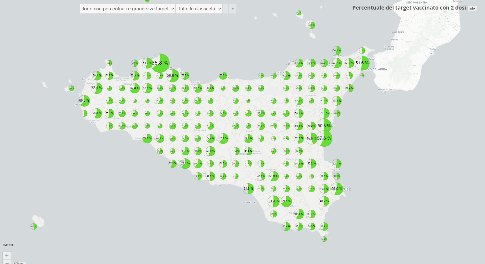
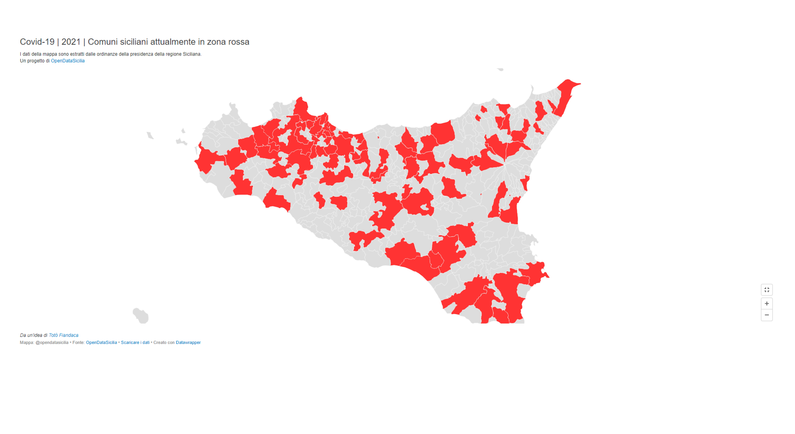
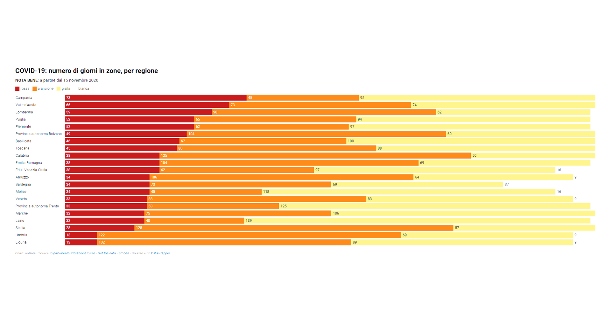

<style> 
.md-content__inner {padding-top: .5rem;  padding-bottom: .5rem; background-image:url({{ config.site_url}}img/covid19_sfondo.png);  background-repeat: no-repeat;  background-attachment: scroll;  background-position: center center;  background-size: contain;}
.md-typeset .md-content__button {display: none!important; }
/*.md-typeset h1, .md-typeset h2 {   display: none!important; }*/
.md-footer__inner {   display: none!important; }
.md-typeset h5 {text-transform: none!important; color: #212529!important;}
.md-typeset h3 { font-weight: bold!important; color: #212529!important;}
</style

<body>
 <link href="stylesheets/home_page.css" rel="stylesheet">
   <section class="page-section">
    
 
          

        

          <h1>  OpenDataSicilia per il #Coronavirus</h1>
		  
 Quando i dati sono disponibili (open, machine readable e con la licenza giusta) ciascuno di noi può dare libero sfogo alle proprie competenze e alla propria fantasia per far parlare quei dati al meglio, scegliendo o creando la rappresentazione che ritiene più efficace per evidenziare quelli che si ritengono gli aspetti salienti. Ed ecco che, com’era prevedibile, la nostra community non si è fatta attendere e si è attivata subito per tradurre quei dati nelle dashboard che a seguire vi presentiamo.

		<!--  <h1> OpenDataSicilia ha aderito alla campagna <a href="https://www.datibenecomune.it/home/" title="#datibenecomune" target="_blank">#datibenecomune</a> </h1> -->
		   
 
		   

		   

   <!-- Elaborazioni -->
  <section class="page-section" id="portfolio">
    
 
          

        

          <h1>I progetti</h1>
          

        <!-- Elaborazioni OpendDataSicilia -->
		

          <a class="portfolio-box" href="vaccini/sit_vaccini/" title="Elaborazioni OpendDataSicilia | Dashboard Vaccini Sicilia| Giugno 2021" target="_self">
            
            

              

                Elaborazioni OpendDataSicilia
              

              

                Dashboard vaccini Sicilia | Giugno 2021
              

            

          </a>
        

	<!--Elaborazioni OpendDataSicilia zone rosse  -->
        

          <a class="portfolio-box" href="elaborazioni/ods/" title="Elaborazioni OpendDataSicilia | Comuni siciliani attualmente in zona rossa | 2021"  target="_self">
            
            

              

                Elaborazioni OpendDataSicilia
              

              

                Comuni siciliani attualmente in zona rossa | 2021
              

            

          </a>
        
		
	<!-- onData -->
        

          <a class="portfolio-box" href="elaborazioni/ondata/" title="Elaborazioni associazione onData | Dashboard varie"  target="_self">
            
            

              

                Elaborazioni cura dell'associazione onData
              

              

                Dashboard varie
              

            

          </a>
        

	
	<!--InformaCOVID -->
        

          <a class="portfolio-box" href="info_covid/informa_covid/" title="InformaCOVID | Il Kit di Comunicazione Efficace per il tuo Comune"  target="_self">
            
            

              

                Progetto InformaCOVID
              

              

                Il Kit di Comunicazione Efficace per il tuo Comune
              

            

          </a>
        

		
			<!--<github -->
        

          <a class="portfolio-box" href="elaborazioni/repo_github/" title="In questa sezione vengono segnalati alcuni repository GitHub di enti pubblici e/o associazioni che condividono e rielaborano in opendata i dati #Covid19."  target="_self">
            
            

              

               Repository GitHub
              

              

               Repository GitHub di enti pubblici e/o associazioni
              

            

          </a>
        

		
 <!-- chiude la sezione schede -->        
      

	    
      
 
	    
 <h1> OpenDataSicilia ha aderito alla campagna <a href="https://www.datibenecomune.it/home/" title="#datibenecomune" target="_blank">#datibenecomune</a>, <a href="https://www.datibenecomune.it/partecipa/" title="#datibenecomune" target="_blank">partecipa</a></h1>	  
         

      </section>
  
</body>